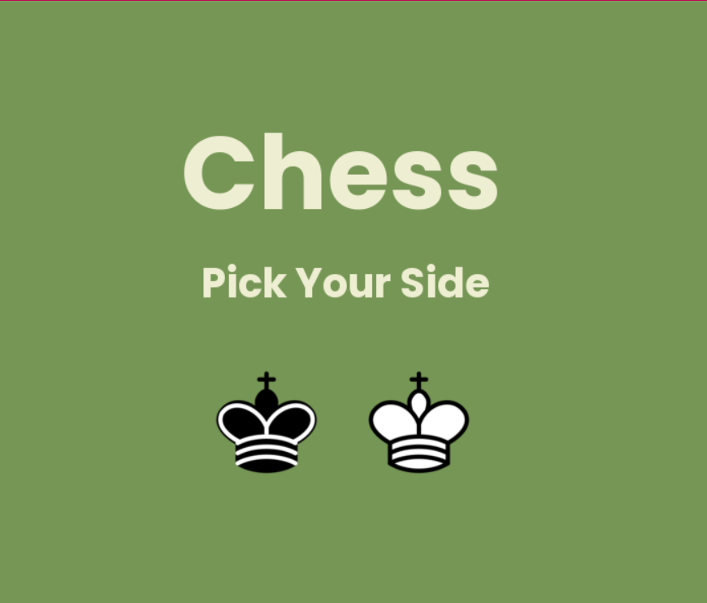
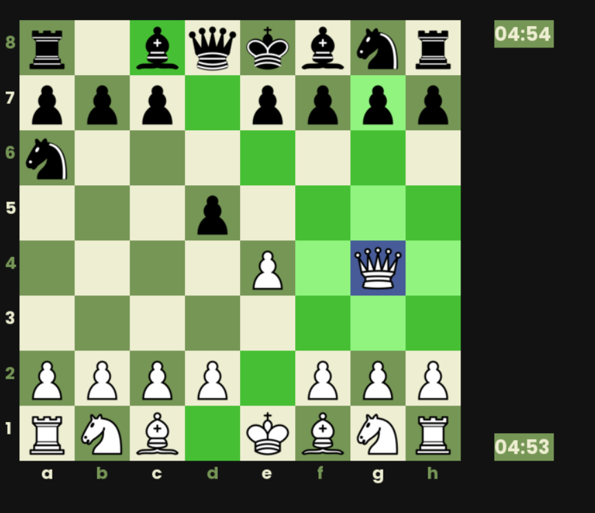
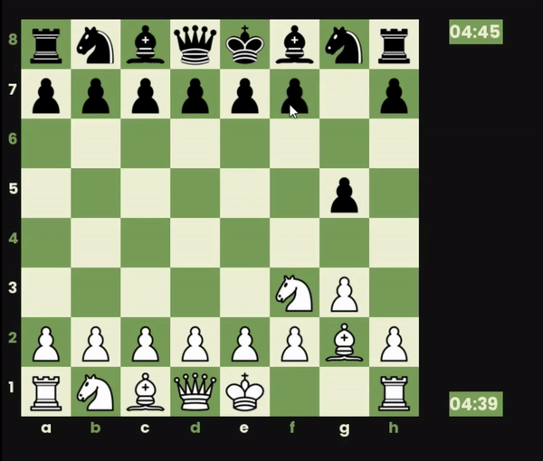
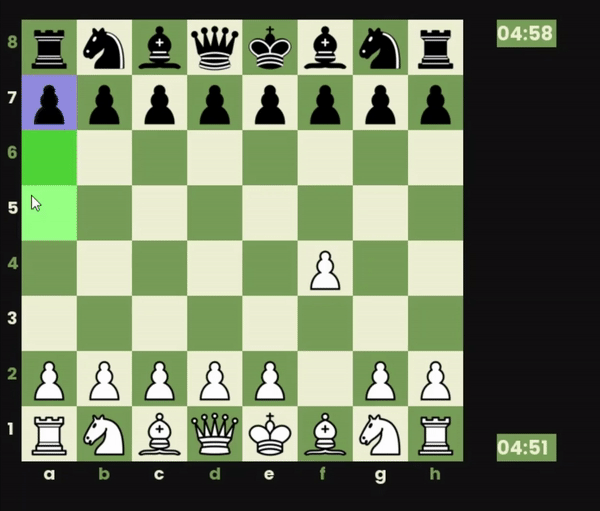
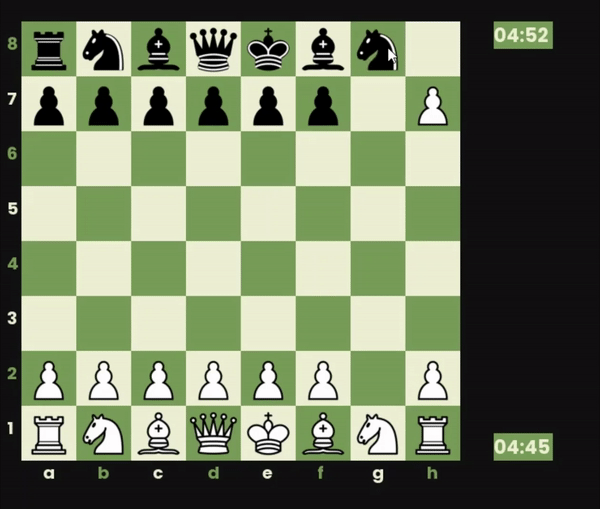

# Chess
A Simple Chess Game Implemented using the Pygame Library

    
    

## About the Engine

The Engine allows all basic moves and highlights possible moves
for selected piece.

Engines also allow special moves like **Castling**, **En Passant** and **Promotion**.

    
    
    

